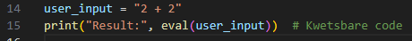
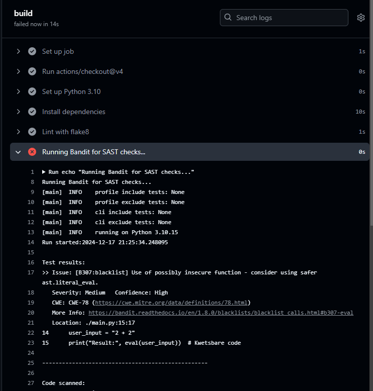
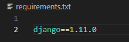
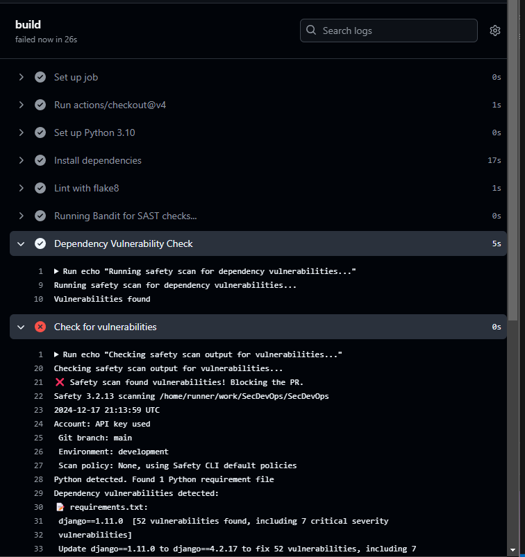
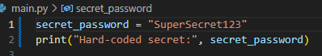
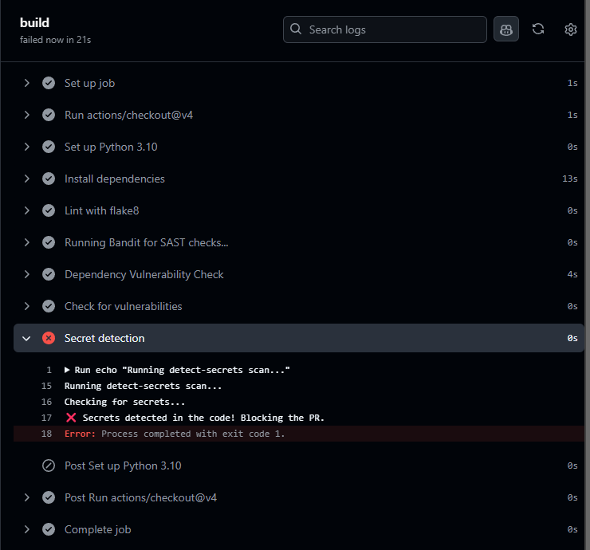

# Verslag

### Inleiding
Dit verslag beschrijft de configuratie van Github Actions workflows die zijn ingesteld om beveiligingsscans uit te voeren voor een Python-project. De geconfigureerde workflows omvatten verschillende checks zoals linting, statische applicatie beveiligings analyse (SAST), kwetsbaarheidsscans voor afhankelijkheden en het detecteren van hardcoded secrets. Deze checks worden geautomatiseerd uitgevoerd wanneer code wordt gepusht naar de main branch of wanneer een pull request (PR) wordt ingediend. Tevens is er een wekelijkse cron job ingesteld om de beveiligingsscans te draaien.

Voor dit verslag zijn er drie specifieke testgevallen uitgevoerd om de werking van de Github Actions workflows te verifiëren. Deze testgevallen bevatten het gebruik van kwetsbare afhankelijkheden, kwetsbare code (gebruik van eval) en hardcoded wachtwoorden in de code.

### 1. **Github Actions Workflow**
De workflow wordt automatisch getriggerd bij push-acties naar de branches main en dev rn ook bij het aanmaken van een pull request naar dezelfde branches. Ook is een wekelijkse scan ingesteld via een cron job. De configuratie bevat verschillende checks zoals flake8, bandit, safety en detect-secrets. Hieronder worden de checks in detail besproken met uitleg over hun werking en hoe ze zijn geconfigureerd.

### 2. **Configuratie/Tests van de Gebruikte Checks**

##### **2.1 Linting met Flake8**
Flake8 is een Python-linter die wordt gebruikt om codekwaliteit te controleren. Het kijkt naar syntaxfouten en stilistische problemen die kunnen leiden tot moeilijk te onderhouden code. Ik heb deze check als eerste test gebruikt.

**Configuratie**:
```
- name: Lint with flake8
  run: |
    flake8 . --count --select=E9,F63,F7,F82 --show-source --statistics
    flake8 . --count --exit-zero --max-complexity=10 --max-line-length=127 --statistics
```

**Doel**: ernstige fouten (E9, F63, F7, F82) die de uitvoering van de code zouden kunnen breken, bijvoorbeeld foutieve imports of syntaxisfouten.
**Codecomplexiteit**: de tweede Flake8-run zoekt naar codecomplexiteit met een maximum van 10 voor de McCabe-complexiteit (hoe moeilijk de code is om te begrijpen) en beperkt de maximale lijnlengte tot 127 tekens.
<br></br>

#### **2.2 Statische Beveiligingsanalyse met Bandit**
Bandit is een tool voor het uitvoeren van statische applicatie beveiligings analyse (SAST) op Python-code. Het zoekt naar bekende beveiligingsproblemen en kwetsbaarheden in de code.

**Configuratie**:
```
- name: Running Bandit for SAST checks...
  run: |
    bandit -r . -ll
```
**Doel**: bandit voert een scan uit op de hele codebasis (-r . geeft aan dat de scan op alle mappen en bestanden moet worden uitgevoerd). De parameter -ll zorgt ervoor dat Bandit alle gevonden problemen logt, zodat ze kunnen worden geanalyseerd.

**Test case**:
Kwetsbare code (gebruik van eval):
De kwetsbare code eval(user_input) werd gebruikt als test om Bandit te triggeren.


**Verwachte uitkomst**: Bandit zou een waarschuwing moeten geven dat het gebruik van eval() een beveiligingsrisico is en de pipeline moeten stoppen, aangezien het toestaat om slechte code te kunnen uitvoeren als het niet goed wordt gevalideerd.

<br></br>

#### **2.3 Kwetsbaarheidsscans voor Afhankelijkheden met Safety**
Safety is een tool die controleert op kwetsbaarheden in de Python-afhankelijkheden van een project, zoals gedetecteerd in het requirements.txt-bestand. Het controleert afhankelijkheden tegen een database van bekende beveiligingslekken. Ik moest eerst een account aanmaken hier, om dan een api key te krijgen. Deze api key heb ik toegevoegd als secret bij de secret variabelen van mijn Github project.

**Configuratie**:
```
- name: Dependency Vulnerability Check
  id: deps
  env:
    SAFETY_API_KEY: ${{ secrets.SAFETY_API_KEY }}
  run: |
    safety scan --api-key $SAFETY_API_KEY --full-report > safety_output.txt || echo "Vulnerabilities found"

- name: Check for vulnerabilities
  run: |
    if [ -f safety_output.txt ]; then
      if grep -q "No issues found" safety_output.txt; then
        echo "✅ No vulnerabilities found in dependencies."
      else
        echo "❌ Safety scan found vulnerabilities! Blocking the PR."
        cat safety_output.txt
        exit 1
      fi
    else
      echo "❌ Safety scan failed or produced no output. Check Safety configuration."
      exit 1
    fi
```

**Doel**: Safety scant de afhankelijkheden op kwetsbaarheden en produceert een uitvoerbestand (safety_output.txt). Dit bestand wordt daarna gecheckt als dit de zin "No issues found" bevat, mag de pipeline verder. Als een kwetsbaarheid toch wordt gevonden zal het bestand geen "No issues found" bevatten en wordt de PR geblokkeerd.

**Test case**:
Testafhankelijkheid: django==1.11.0
Deze versie van Django bevat bekende kwetsbaarheden die door Safety moeten worden gedetecteerd.


**Verwachte uitkomst**: Safety zou moeten melden dat de django==1.11.0 versie kwetsbaar is en de PR zou geblokkeerd moeten worden.

<br></br>

#### **2.4 Detectie van Hardcoded Secrets met Detect-Secrets**
Detect-secrets is een tool die zoekt naar hardcoded geheimen zoals API-sleutels, wachtwoorden en andere gevoelige gegevens in de code.

**Configuratie**:
```
- name: Secret detection
  id: secrets
  run: |
    detect-secrets scan > .secrets.baseline
    if grep -q '"hashed_secret"' .secrets.baseline; then
      echo "❌ Secrets detected in the code! Blocking the PR."
      exit 1
    else
      echo "✅ No secrets detected."
    fi
```

**Doel**: Detect-secrets scant de code op aanwezigheid van geheimen zoals wachtwoorden of API-sleutels. Als er geheimen worden gevonden, wordt de PR geblokkeerd. 

**Test case**:
Hardcoded wachtwoord: SuperSecret123


**Verwachte uitkomst**: Detect-secrets zou het hardcoded wachtwoord moeten detecteren en de PR blokkeren met de melding dat er een geheim is gevonden.

<br></br>

4. **Conclusie**
De configuratie van de Github Actions workflows is succesvol en effectief in het detecteren van beveiligingsproblemen in de code. De verschillende checks (flake8, bandit, safety, detect-secrets) zijn goed geïmplementeerd en werken zoals verwacht. De resultaten van de tests bevestigen dat de workflows kwetsbaarheden in afhankelijkheden, kwetsbare code en hardcoded secrets kunnen detecteren en PR's blokkeren wanneer deze problemen worden gevonden.
